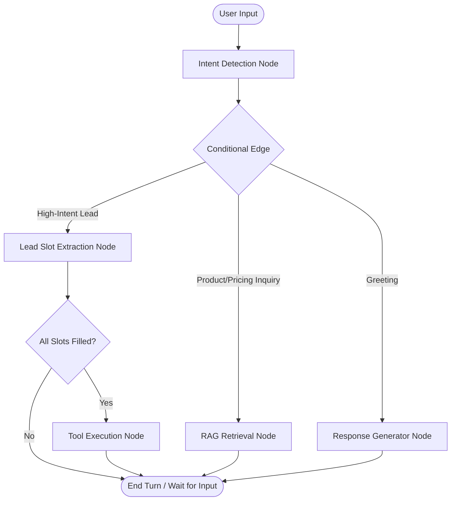

# AutoStream Agentic AI: Social-to-Lead Conversational Assistant

Welcome to the **AutoStream Agentic AI** repository. This project is a production-grade, conversational sales and support agent built for the fictional SaaS company **AutoStream** (operating under the ServiceHive/Inflx platform). 

The agent utilizes **LangGraph** state machines to orchestrate multi-turn slot-filling lead capture workflows, retrieves real-time pricing and features from a local **FAISS Vector Database** using Retrieval-Augmented Generation (RAG), and features a premium, responsive **Streamlit** user interface designed to replicate modern commercial AI products (like ChatGPT and Claude).

---

## 📖 Overview

### What is Agentic AI?
Unlike simple prompt-based chatbots, **Agentic AI** systems are autonomous entities that make decisions, determine execution routing, and call external APIs (tools) based on conversation state. This project models the conversational sales funnel as a state machine. It uses LangGraph to manage complex state transitions deterministically, ensuring that intent is classified accurately, information is collected progressively (slot-filling), and backend capture APIs are triggered only when all lead variables are satisfied.

### Retrieval-Augmented Generation (RAG)
To handle product inquiries, the agent employs **RAG**. When users ask about pricing, features, or refund policies, the agent queries a local vector store containing AutoStream's knowledge database. This retrieved context is injected into the LLM prompt, ensuring the chatbot provides highly accurate, factually grounded answers and completely avoids hallucinating custom plans or pricing details.

### Lead Qualification Funnel
Once the agent detects high user intent (e.g., a desire to upgrade or purchase a subscription), it transitions into a structured **lead qualification workflow**. It progressively prompts for, validates, and stores:
1. **Lead Name**
2. **Lead Email**
3. **Creator Platform** (e.g. YouTube, Instagram, TikTok)

Once all slots are successfully filled, the agent automatically executes the mock CRM lead capture tool to write the customer details to the database.

---

## 🏛️ Architecture

The conversational state graph is structured as follows:



---

## ✨ Features

- **LangGraph State Graph**: Models the entire conversational flow as a state machine with persistent session checkpointer memory.
- **Gemini 2.5 Flash Integration**: Powered by Google Gemini API for fast, reliable intent classification and natural response generation.
- **FAISS Vector Store RAG**: Performs semantic search over local markdown documents using Google Text Embeddings for pricing and policy queries.
- **Structured Lead Slot-Filling**: Dynamically tracks and extracts parameters progressively over multiple turns.
- **Mock CRM Integration**: Automatically executes backend mock lead capture tools upon slot completion.
- **Premium Streamlit UI**: Modern dark theme with custom glassmorphic cards, linear progress bars, active intent badges, and visual RAG retrieval status indicators.

---

## 🛠️ Tech Stack

- **Core Logic**: Python 3.11
- **Orchestration**: LangGraph, LangChain Core
- **Vector Search**: FAISS (Facebook AI Similarity Search)
- **AI Models**: Google Gemini 2.5 Flash, Google Text Embeddings (`models/gemini-embedding-001`)
- **Dashboard Interface**: Streamlit

---

## 📂 Project Structure

```text
AutoStream-Agentic-AI/
│
├── app.py                     # CLI Interactive Chatbot Runner
├── streamlit_app.py           # Premium Streamlit GUI Web Dashboard
├── requirements.txt           # Python Package Dependencies
├── .gitignore                 # Files excluded from Git
├── .env.example               # Environment Variables template
├── README.md                  # Comprehensive documentation and setup guide
│
├── agent/                     # Core Agent Module
│   ├── __init__.py
│   ├── graph.py               # LangGraph StateGraph state machine structure
│   ├── intents.py             # LLM Intent classification node logic
│   ├── rag.py                 # FAISS Loader and semantic retrieval helper
│   ├── state.py               # TypedDict schema definition for Agent State
│   └── tools.py               # Mock CRM API Lead Capture function
│
└── data/                      # Local Knowledge Base
    └── knowledge_base.md      # AutoStream pricing tiers, features, and policies
```

---

## 🚀 Setup Instructions

### Prerequisites
- Python 3.11 or 3.12 installed
- A **Google Gemini API Key** (Get a free developer key from [Google AI Studio](https://aistudio.google.com/))

### 1. Clone & Navigate
```bash
git clone https://github.com/praneethreddyganta/AutoStream-Agentic-AI.git
cd AutoStream-Agentic-AI
```

### 2. Set Up Virtual Environment
```bash
python3.11 -m venv venv
source venv/bin/activate
```

### 3. Install Dependencies
```bash
pip install --upgrade pip setuptools wheel
pip install -r requirements.txt
```

### 4. Configure Secrets
Copy the environment template:
```bash
cp .env.example .env
```
Open `.env` and paste your Gemini API key:
```env
GOOGLE_API_KEY=AIzaSyYourActualGoogleGeminiKeyHere
```

### 5. Running the Application
- **Run the CLI Interactive Chatbot**:
  ```bash
  python app.py
  ```
- **Run the Premium Streamlit Dashboard**:
  ```bash
  streamlit run streamlit_app.py
  ```

---

## ☁️ Streamlit Community Cloud Deployment

To deploy this application to **Streamlit Community Cloud** for production access:

1. Push your repository to GitHub.
2. Log in to [Streamlit Community Cloud](https://share.streamlit.io/) with your GitHub account.
3. Click **New app**, select your repository, set the branch to `main`, and set the file path to:
   ```text
   streamlit_app.py
   ```
4. Click **Advanced settings** before deploying. Under the **Secrets** section, configure your environment variables:
   ```toml
   GOOGLE_API_KEY = "AIzaSyYourActualGoogleGeminiKeyHere"
   ```
5. Click **Save** and then **Deploy**. Your app will be live on the web in seconds!

---

## 💬 Example Conversation

```text
User: Hi
Agent: Hello! Welcome to AutoStream, your automated video editing partner. How can I assist you with your content creation journey today?

User: How much does the Pro plan cost?
Agent: The AutoStream Pro Plan costs $79/month. It includes unlimited videos, 4K rendering, AI captions, and 24/7 priority live support.

User: I want the Pro plan for my YouTube channel.
Agent: Excellent choice! I'd love to help you get started on our Pro Plan. May I know your name first?

User: Praneeth
Agent: Thanks, Praneeth! Please share your email address.

User: praneeth@gmail.com
Agent: Lead captured successfully: Praneeth, praneeth@gmail.com, YouTube!
```

---

## 🔮 Future Improvements

- **Omnichannel Webhooks**: Deploy FastAPI endpoints to integrate the agent directly with WhatsApp Business and Telegram.
- **CRM Integration**: Connect the lead capture tool to write details directly to Salesforce, Hubspot, or Notion databases.
- **Multi-Agent Collaboration**: Split the graph into specialized subagents (e.g., an Billing Specialist agent, a Technical Support agent, and a Sales agent) routing queries dynamically.
