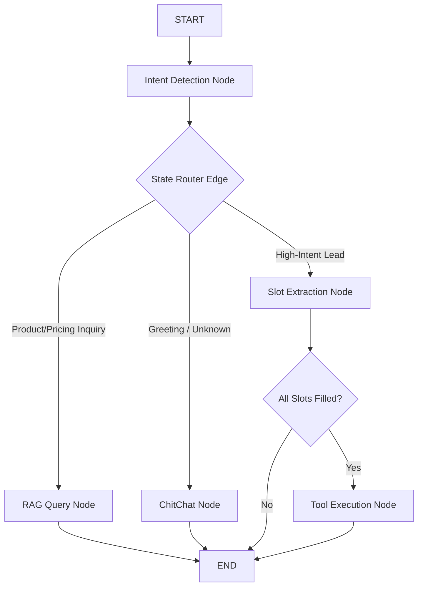

# AutoStream Social-to-Lead Conversational AI Agent

Welcome to the **AutoStream AI Agent** project codebase. This is a production-grade, conversational sales and support agent built for the fictional SaaS company **AutoStream** (under the ServiceHive/Inflx platform). 

The agent is designed to classify user intents, retrieve product and pricing features using Retrieval-Augmented Generation (RAG) powered by a local FAISS database, and execute a dynamic multi-turn lead-qualification slot-filling workflow that triggers a backend mock lead capture API tool.

**This implementation is configured to use Google Gemini (Gemini 1.5 Flash) and Google Text Embeddings, making development and execution completely FREE using Google AI Studio developer keys!**

---

## 📁 Folder Structure

```text
servicehive-agent/
│
├── app.py                     # Main CLI interactive chatbot runner
├── requirements.txt           # Python package dependencies
├── README.md                  # Comprehensive documentation and setup guide
├── .env.example               # Environment variable configuration template
│
├── agent/                     # Core Agent Logic
│   ├── __init__.py
│   ├── graph.py               # LangGraph StateGraph state machine structure
│   ├── intents.py             # LLM Intent classification node logic
│   ├── rag.py                 # RAG document loader, vector store index, and retriever
│   ├── tools.py               # Mock lead capture tool function
│   └── state.py               # Agent State TypedDict schema definition
│
└── data/                      # Local Knowledge Base
    └── knowledge_base.md      # AutoStream pricing tiers, features, and refund policies
```

---

## 🚀 Installation and Setup

### Prerequisites
- Python 3.11 or higher
- A **Google Gemini API Key** (Completely FREE at [Google AI Studio](https://aistudio.google.com/))

### 1. Clone & Navigate to the Project
```bash
cd /Users/gantapraneethreddy/.gemini/antigravity/scratch/servicehive-agent
```

### 2. Set Up a Virtual Environment (Recommended)
```bash
python3 -m venv venv
source venv/bin/activate
```

### 3. Install Dependencies
```bash
pip install --upgrade pip
pip install -r requirements.txt
```

### 4. Configure Environment Variables
Copy the `.env.example` file to create an active `.env` file:
```bash
cp .env.example .env
```
Open `.env` in your text editor and paste your Google API key:
```env
GOOGLE_API_KEY=AIzaSyYourActualGoogleGeminiKeyHere
```

---

## 🏃 Running the Agent Locally

Start the interactive terminal CLI chatbot interface:
```bash
python3 app.py
```

### 💬 Conversation Walkthrough Example

```text
You: Hi
Bot: Hello! Welcome to AutoStream, your automated video editing partner. How can I assist you with your content creation journey today?

You: Tell me about your pricing.
Bot: AutoStream offers two primary pricing tiers to suit your needs:
1. **Basic Plan** ($29/month): Includes rendering 10 videos per month at 720p resolution.
2. **Pro Plan** ($79/month): Offers unlimited videos, rendering in crisp 4K resolution, and AI captions.

You: I want the Pro plan for my YouTube channel.
Bot: Great choice! I'd love to help you get started on our Pro Plan. May I know your name first?

You: Praneeth
Bot: Please share your email.

You: praneeth@gmail.com
Bot: Which creator platform do you use?

You: YouTube

[TOOL EXECUTION] Lead captured successfully: Praneeth, praneeth@gmail.com, YouTube
Bot: Lead captured successfully: Praneeth, praneeth@gmail.com, YouTube
```

---

## 🏛️ Architecture Explanation

### Why LangGraph?
We selected **LangGraph** over AutoGen because our Social-to-Lead workflow requires deterministic, stateful flow control. While AutoGen excels at free-form, multi-agent debates, it introduces conversational drift and unpredictability that makes slot-filling highly unreliable. LangGraph models workflows as an elegant **StateGraph** state machine. This structure provides fine-grained control over state transitions, allowing us to enforce strict conditional logic: RAG queries resolve immediately, while high-intent lead qualification locks the conversation into a robust step-by-step extraction loops, executing tools only after all slots are filled.

### State Management
State is managed globally in our `AgentState` schema defined as a Python `TypedDict`. This state tracks conversation history (`messages`), detected intent, and lead slots (`lead_name`, `lead_email`, `lead_platform`, `lead_collection_stage`). 



Using LangGraph’s persistent `MemorySaver` checkpointer, state variables are automatically serialized and cached. Every turn uses a session-bound `thread_id` configuration, allowing multiple concurrent users to have their conversations and qualified slots managed independently without cross-talk or data leakage.

---

## 💬 WhatsApp Webhook Deployment Integration

To deploy this conversational AI agent to **WhatsApp** in a production environment, follow this structured integration architecture:

### 1. Architecture Flow Diagram
```text
┌──────────┐  Webhook HTTP POST   ┌──────────────┐  State Resolution   ┌───────────┐
│ WhatsApp │─────────────────────>│ FastAPI Host │────────────────────>│ LangGraph │
│  Client  │<─────────────────────│ Webhook Server│<───────────────────│ Workflow  │
└──────────┘  WhatsApp Send API   └──────────────┘  Persistent DB      └───────────┘
```

### 2. Step-by-Step Webhook Workflow

1.  **Meta Portal Setup**:
    - Register a Meta Developer Application and set up the **WhatsApp Business API** product.
    - Configure a Webhook callback endpoint pointing to your cloud-hosted backend server (e.g., FastAPI/Flask deployed on GCP, AWS, or Render) using HTTPS.
    - Set up a unique **Verification Token** to validate the handshake between Meta and your server.

2.  **Receiving Incoming Messages**:
    - When a user sends a text message to the WhatsApp Business number, Meta dispatches an HTTPS `POST` JSON payload to your webhook.
    - Your server receives the payload, verifies the payload authenticity using the `X-Hub-Signature-256` header (hmac-sha256 signature with your App Secret), and extracts:
      - The user's **phone number** (e.g., `+919988776655`).
      - The **message text** (e.g., `"How much is the Pro plan?"`).

3.  **LangGraph State Execution & Persistence**:
    - The user's **phone number** is mapped directly as the LangGraph `thread_id`. This acts as the session index in the persistent checkpointer database (e.g., PostgreSQL or Redis Checkpointer).
    - The webhook server invokes the compiled LangGraph workflow:
      ```python
      config = {"configurable": {"thread_id": user_phone_number}}
      state_output = await compiled_graph.ainvoke(
          {"messages": [HumanMessage(content=message_text)]}, 
          config
      )
      ```
    - LangGraph loads the user's historical state from database storage, executes intent classification, does FAISS search or updates lead capture slots, writes the updated state back to database storage, and generates an AI message reply.

4.  **Replying to the User**:
    - The webhook server extracts the content of the final AI message from the state output.
    - It triggers an HTTPS `POST` request to Meta's WhatsApp Send Message Endpoint:
      ```bash
      POST https://graph.facebook.com/v18.0/<YOUR_BUSINESS_PHONE_NUMBER_ID>/messages
      Authorization: Bearer <YOUR_ACCESS_TOKEN>
      Content-Type: application/json
      
      {
        "messaging_product": "whatsapp",
        "to": "<USER_PHONE_NUMBER>",
        "type": "text",
        "text": { "body": "<ASSISTANT_REPLY>" }
      }
      ```
    - The user receives the AI agent's response directly in their WhatsApp chat thread.
